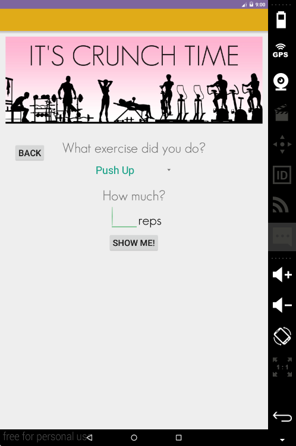

# PROG 01: Crunch Time

Briefly describe your app here.
My app lets a user choose whether they want to convert an amount of exercise into the calories ones burn by doing that, or if they want to convert an amount of calories into the exercise that will burn that. It works with exercises: Pushups, sit-ups, squats, leg-lifts, plank, jumping jacks, pull-ups, cycling, walking, jogging, swimming, stair climbing. 

My app gives motivational text when the conversion happens to encourage the user to keep on exercising. A user is able to navigate between the two functions of conversion. 

## Authors

Corrina Calanoc ([corrina.calanoc@berkeley.edu](mailto:corrina.calanoc@berkeley.edu))

## Demo Video

See Prog01 (https://drive.google.com/file/d/0B2tbpHNjZAudVkdwal9ZcWNXaFU/view?usp=sharing)

## Screenshots

## Acknowledgments

* Hat tip to anyone who's code was used
* Any other support

TY to stack overflow for showing me how to use GridView’s and Buttons!! Also for showing me how to change the color of my font, how to change my font, and how to make things invisible!

*Feel free to enhance your README. For Markdown syntax, see [the GitHub Guides](https://guides.github.com/features/mastering-markdown/). Remove this line in your submission.*
